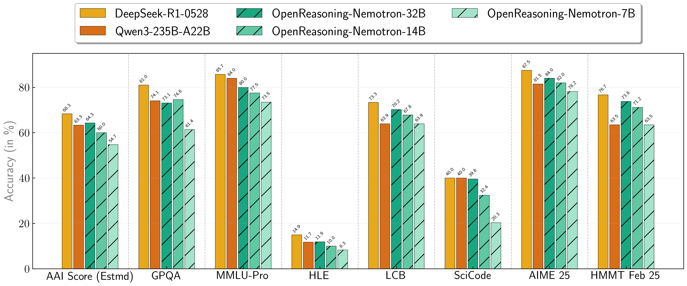
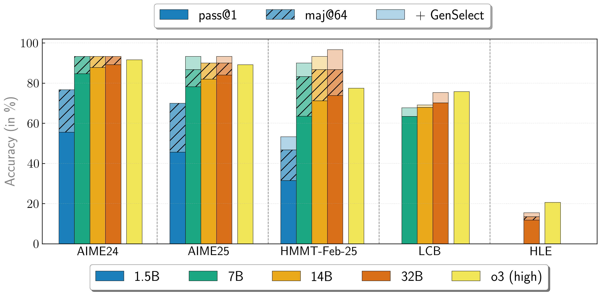

# Nemo Skills

Nemo-Skills is a collection of pipelines to improve "skills" of large language models (LLMs). We support everything needed for LLM development, from synthetic data generation, to model training, to evaluation on a wide range of benchmarks. Start developing on a local workstation and move to a large-scale Slurm cluster with just a one-line change.


Here are some of the features we support:

- [Flexible LLM inference](https://nvidia-nemo.github.io/Skills/pipelines/generation/):
  - Seamlessly switch between API providers, local server and large-scale slurm jobs for LLM inference.
  - Host models (on 1 or many nodes) with [TensorRT-LLM](https://github.com/NVIDIA/TensorRT-LLM), [vLLM](https://github.com/vllm-project/vllm), [sglang](https://github.com/sgl-project/sglang) or [Megatron](https://github.com/NVIDIA/Megatron-LM).
  - Scale SDG jobs from 1 GPU on a local machine all the way to tens of thousands of GPUs on a slurm cluster.
- [Model evaluation](https://nvidia-nemo.github.io/Skills/evaluation):
  - Evaluate your models on many popular benchmarks.
    - [**Math (natural language**)](https://nvidia-nemo.github.io/Skills/evaluation/natural-math): e.g. [aime24](https://nvidia-nemo.github.io/Skills/evaluation/natural-math/#aime24), [aime25](https://nvidia-nemo.github.io/Skills/evaluation/natural-math/#aime25), [hmmt_feb25](https://nvidia-nemo.github.io/Skills/evaluation/natural-math/#hmmt_feb25)
    - [**Math (formal language)**](https://nvidia-nemo.github.io/Skills/evaluation/formal-math): e.g. [minif2f](https://nvidia-nemo.github.io/Skills/evaluation/formal-math/#minif2f), [proofnet](https://nvidia-nemo.github.io/Skills/evaluation/formal-math/#proofnet), [putnam-bench](https://nvidia-nemo.github.io/Skills/evaluation/formal-math/#putnam-bench)
    - [**Code**](https://nvidia-nemo.github.io/Skills/evaluation/code): e.g. [swe-bench](https://nvidia-nemo.github.io/Skills/evaluation/code/#swe-bench), [livecodebench](https://nvidia-nemo.github.io/Skills/evaluation/code/#livecodebench)
    - [**Scientific knowledge**](https://nvidia-nemo.github.io/Skills/evaluation/scientific-knowledge): e.g., [hle](https://nvidia-nemo.github.io/Skills/evaluation/scientific-knowledge/#hle), [scicode](https://nvidia-nemo.github.io/Skills/evaluation/scientific-knowledge/#scicode), [gpqa](https://nvidia-nemo.github.io/Skills/evaluation/scientific-knowledge/#gpqa)
    - [**Instruction following**](https://nvidia-nemo.github.io/Skills/evaluation/instruction-following): e.g. [ifbench](https://nvidia-nemo.github.io/Skills/evaluation/instruction-following/#ifbench), [ifeval](https://nvidia-nemo.github.io/Skills/evaluation/instruction-following/#ifeval)
    - [**Long-context**](https://nvidia-nemo.github.io/Skills/evaluation/long-context): e.g. [ruler](https://nvidia-nemo.github.io/Skills/evaluation/long-context/#ruler), [mrcr](https://nvidia-nemo.github.io/Skills/evaluation/long-context/#mrcr), [aalcr](https://nvidia-nemo.github.io/Skills/evaluation/long-context/#aalcr)
    - [**Tool-calling**](https://nvidia-nemo.github.io/Skills/evaluation/tool-calling): e.g. [bfcl_v3](https://nvidia-nemo.github.io/Skills/evaluation/tool-calling/#bfcl_v3)
    - [**Multilingual**](https://nvidia-nemo.github.io/Skills/evaluation/multilingual): e.g. [mmlu-prox](https://nvidia-nemo.github.io/Skills/evaluation/multilingual/#mmlu-prox), [FLORES-200](https://nvidia-nemo.github.io/Skills/evaluation/multilingual/#FLORES-200), [wmt24pp](https://nvidia-nemo.github.io/Skills/evaluation/multilingual/#wmt24pp)
    - [**Speech & Audio**](https://nvidia-nemo.github.io/Skills/evaluation/speech-audio): e.g. [asr-leaderboard](https://nvidia-nemo.github.io/Skills/evaluation/speech-audio/#asr-leaderboard), [mmau-pro](https://nvidia-nemo.github.io/Skills/evaluation/speech-audio/#mmau-pro)
  - Easily parallelize each evaluation across many slurm jobs, self-host LLM judges, bring your own prompts or change benchmark configuration in any other way.
- [Model training](https://nvidia-nemo.github.io/Skills/pipelines/training): Train models using [NeMo-RL](https://github.com/NVIDIA-NeMo/RL/) or [verl](https://github.com/volcengine/verl).

## News
* [12/15/2025]: Released the recipe for reproducing [Nemotron-Math-v2](https://huggingface.co/datasets/nvidia/Nemotron-Math-v2) and [Nemotron-Math-Proofs-v1](https://huggingface.co/datasets/nvidia/Nemotron-Math-Proofs-v1) datasets that were used as part of the training data for [NVIDIA-Nemotron-3-Nano-30B-A3B-BF16](https://huggingface.co/nvidia/NVIDIA-Nemotron-3-Nano-30B-A3B-BF16).
* [11/25/2025]: Added the recipe for reproducing the main [experimental results](https://github.com/NVIDIA-NeMo/Skills/tree/main/recipes/proof-gen-verification) for [Scaling Generative Verifiers For Natural Language Mathematical Proof Verification And Selection](https://arxiv.org/abs/2511.13027).
* [08/22/2025]: Added details for [reproducing evals](https://nvidia-nemo.github.io/Skills/tutorials/2025/08/22/reproducing-nvidia-nemotron-nano-9b-v2-evals/) for the [NVIDIA-Nemotron-Nano-9B-v2](https://huggingface.co/nvidia/NVIDIA-Nemotron-Nano-9B-v2) model by NVIDIA.
* [08/15/2025]: Added details for [reproducing evals](https://nvidia-nemo.github.io/Skills/tutorials/2025/08/15/reproducing-llama-nemotron-super-49b-v15-evals/) for the [Llama-3_3-Nemotron-Super-49B-v1_5](https://huggingface.co/nvidia/Llama-3_3-Nemotron-Super-49B-v1_5) model by NVIDIA.
* [07/30/2025]: The datasets used to train OpenReasoning models are released! Math and code are available as part of [Nemotron-Post-Training-Dataset-v1](https://huggingface.co/datasets/nvidia/Nemotron-Post-Training-Dataset-v1) and science is available in
[OpenScienceReasoning-2](https://huggingface.co/datasets/nvidia/OpenScienceReasoning-2).
See our [documentation](https://nvidia-nemo.github.io/Skills/releases/openreasoning/training) for more details.

* [07/18/2025]: We released [OpenReasoning](https://nvidia-nemo.github.io/Skills/releases/openreasoning/) models! SOTA scores on math, coding and science benchmarks.






* [04/23/2025]: We released [OpenMathReasoning](https://nvidia-nemo.github.io/Skills/openmathreasoning1) dataset and models!

  * OpenMathReasoning dataset has 306K unique mathematical problems sourced from [AoPS forums](https://artofproblemsolving.com/community) with:
      * 3.2M long chain-of-thought (CoT) solutions
      * 1.7M long tool-integrated reasoning (TIR) solutions
      * 566K samples that select the most promising solution out of many candidates (GenSelect)
  * OpenMath-Nemotron models are SoTA open-weight models on math reasoning benchmarks at the time of release!

* [10/03/2024]: We released [OpenMathInstruct-2](https://nvidia-nemo.github.io/Skills/openmathinstruct2) dataset and models!

  * OpenMathInstruct-2 is a math instruction tuning dataset with 14M problem-solution pairs generated using the Llama3.1-405B-Instruct model.
  * OpenMath-2-Llama models show significant improvements compared to their Llama3.1-Instruct counterparts.

## Getting started

To get started, follow these [steps](https://nvidia-nemo.github.io/Skills/basics),
browse available [pipelines](https://nvidia-nemo.github.io/Skills/pipelines) or run `ns --help` to see all available
commands and their options.

You can find more examples of how to use Nemo-Skills in the [tutorials](https://nvidia-nemo.github.io/Skills/tutorials) page.

We've built and released many popular models and datasets using Nemo-Skills. See all of them in the [Papers & Releases](./releases/index.md) documentation.

You can find the full documentation [here](https://nvidia-nemo.github.io/Skills/).


## S2S FC Eval Scorecard

Tools for generating and viewing a single-page HTML scorecard that aggregates metrics from all S2S FC eval benchmarks (VoiceBench nonMCQ/MCQ, FDB, BBA, BFCL, conv_behav).

### Generating the scorecard

The scorecard is generated via a Claude Code slash command. Run it inside a `claude` session:

```
/make-scorecard
```

Optional arguments:

| Argument | Description | Default |
|---|---|---|
| `name=<filename>` | Output HTML filename (`.html` appended if omitted) | `scorecard` |
| `output_dir=<path>` | Base output dir for all benchmarks; results are read from `{output_dir}/{mode}_{commit}/` | read from each benchmark's config YAML |
| `eval_mode=<mode>` | `greedy`, `sampling`, or `greedy+sampling` | `greedy+sampling` |

Examples:

```
/make-scorecard
/make-scorecard name=my_run
/make-scorecard name=my_run eval_mode=greedy
/make-scorecard name=my_run output_dir=/path/to/results eval_mode=greedy+sampling
```

Output is written to `asset/{name}.html`. The scorecard includes:
- Summary tiles and radar chart across all benchmarks
- Per-benchmark metric breakdowns (greedy and sampling side by side)
- Audio example playback for VoiceBench CommonEval, FDB turn-taking/pause, BBA Navigate, and conv_behav agent sessions

### Viewing the scorecard

Audio playback requires an HTTP server on the cluster. Run:

```bash
bash scripts/serve_scorecard.sh [--name <filename>] [--port <port>]
```

The script will:
1. List all available scorecards in `asset/` with their browser URLs
2. Start an HTTP server (auto-selects a free port in 8780–8799 if `--port` is omitted)
3. Print the SSH tunnel command to run on your laptop
4. Print the browser URL to open

Example output:

```
Available scorecards in .../asset/:
  http://localhost:8780/.../asset/scorecard.html
  http://localhost:8780/.../asset/my_run.html

════════════════════════════════════════════════════════════
  Run this on your LAPTOP:

    ssh -L 8780:127.0.0.1:8780 <user>@draco-oci-login-01.draco-oci-iad.nvidia.com -N &

  Then open in browser:
    http://localhost:8780/.../asset/my_run.html

  To stop the server:
    kill <PID>
════════════════════════════════════════════════════════════
```

Press **Ctrl+C** in the terminal running `serve_scorecard.sh` to stop the server.

---

## Contributing

We welcome contributions to Nemo-Skills! Please see our [Contributing Guidelines](./CONTRIBUTING.md) for more information on how to get involved.


Disclaimer: This project is strictly for research purposes, and not an official product from NVIDIA.
